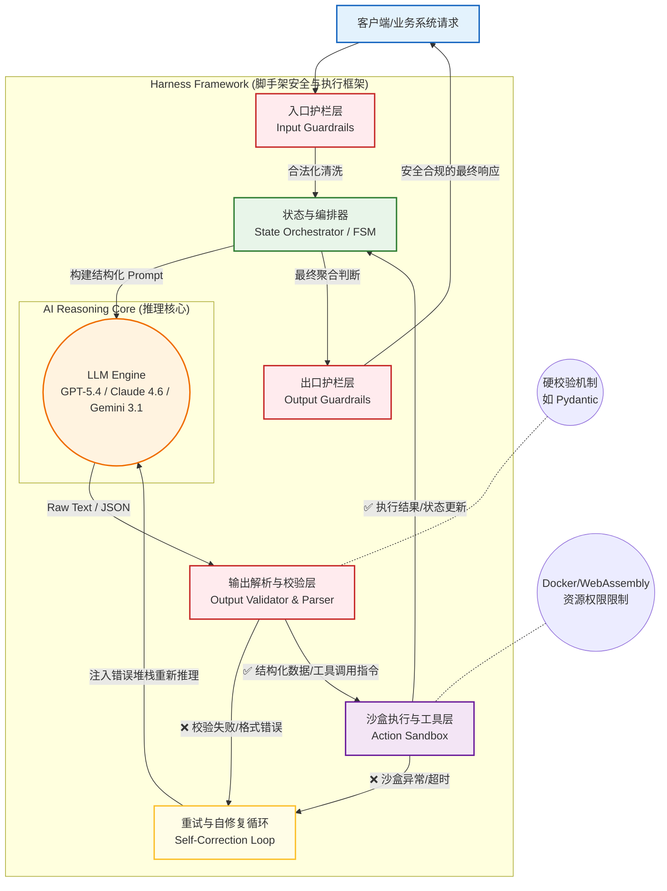

# AI 工程化全景图：从 Prompt 到 Harness Engineering 的深度解析

在构建大语言模型（LLM）驱动的商业级应用时，我们正经历一场从“玩具”向“基础设施”的演进。这其中，行业逐渐沉淀出了四个不同层级的工程化方向：**Prompt Engineering**、**Context Engineering**、**Agent Engineering**，以及近期愈发受到重视的 **Harness Engineering**。

如果我们把构建 AI 应用比作制造一辆现代汽车：
*   **Prompt Engineering（提示层）**：你是驾驶员踩下油门的方式，告诉引擎你需要如何运转。
*   **Context Engineering（上下文层）**：你是车载导航和雷达系统，时刻为引擎提供路况和目的地背景。
*   **Agent Engineering（智能体层）**：你是自动驾驶算法，负责规划路线、调用刹车和转向系统。
*   **Harness Engineering（脚手架/线束层）**：你是最底层的**物理底盘、制动系统及保险丝**。它确保无论自动驾驶算法下达了多么离谱的指令，车子都不会在高速上倒车或冲下悬崖。

这里还有一个更加生动且贴切的隐喻：**驾驭烈马**。
LLM / Agent 就像一匹力量不可思议、速度极快，但方向感不稳定的“烈马”。它不天然遵守你的项目规则，也不天然知道什么时候该停下求助。
Harness Engineering 的本质，就是给这匹马配上**“缰绳 + 马鞍 + 跑道护栏 + 反馈镜子”**。它不是让马变得更聪明，而是构建一整套运行控制系统，让它跑得稳、跑得久、不跑偏。

本文将重点对 **Harness Engineering（大模型脚手架/线束工程）** 的深层原理与精细化架构进行专业级的剖析，探讨如何通过确定性的工程手段，驾驭非确定性的 AI 模型。

---

## 一、 Harness Engineering 的底层原理与核心哲学

在开发 AI Agent 的初期，开发者习惯于将所有的约束写在系统提示词（System Prompt）中：*“你必须返回合法的 JSON”、“你不能讨论政治”、“遇到异常请重试”*。

然而，**系统的高可靠性永远不能建立在概率之上**。Harness Engineering 的诞生，是对 LLM 作为“非确定性黑盒”与软件工程要求“确定性契约”之间巨大矛盾的妥协与突破。

它的核心哲学可以总结为三大开发范式：

1.  **控制反转 (Inversion of Control for LLMs)**：
    传统的 Agent 开发中，大模型负责主导流程流转（比如在 ReAct 循环中自己决定什么时候思考，什么时候执行）。在 Harness 理念中，**控制权被交还给传统的代码框架（编排器）**。大模型只作为被调用的纯粹的“推理函数（Reasoning Engine）”，系统状态的流转由状态机（FSM）或有向无环图（DAG）接管。
2.  **深度防御性编程 (Deep Defensive Programming)**：
    永远假设大模型的输出是不可靠、有瑕疵或者是恶意的。在模型输出达到业务逻辑或外部工具之前，必须经过多层清洗、反序列化、格式校验与安全审查。
3.  **确定性的物理隔离 (Deterministic Isolation)**：
    模型执行代码（如 Python 执行器）、调用数据库、操纵文件系统时，绝不能与主应用共享环境。Harness 提供严格的沙盒机制，限制 CPU/内存耗用及网络外联，防止单点故障引发全局崩溃。

---

## 二、 Harness Engineering 核心架构图解

为了实现上述原理，一个标准的企业级 Harness（如 Anthropic 的生产级集成或类似的 Agent 脚手架引擎）通常具备如下多层剥离的架构设计：

### 架构组件精细化拆解：

#### 1. 状态与编排器 (State Orchestrator)
*   **功能定位**：系统的“大脑皮层”。放弃大模型自己做复杂的长链路状态追踪，改为由后台数据库或内存维护一张“会话黑板（Blackboard）”或图结构。
*   **实现机制**：使用状态机来定义 Agent 可以走哪些路径。例如在客服场景，只有当订单状态校验通过后，编排器才会放行流程调用“退款大模型节点”。如果发生致命错误，由编排器直接跳转到“人工干预”节点。

#### 2. 护栏层 (Input & Output Guardrails)
*   **功能定位**：系统的“免疫屏障”。
*   **实现机制**：
    *   **Input Guardrails**：拦截 Prompt 注入（如查杀 "忽略之前的指令" 等字眼）、Pii（个人隐私信息）掩码脱敏。
    *   **Output Guardrails**：基于白名单/黑名单模式（如 NeMo Guardrails），或使用一个小型的、极快且廉价的判别模型来作为“审查员”，确保最终返回给用户的文本不带有害性或竞品提及。

#### 3. 输出解析与校验层 (Output Validator & Parser)
*   **功能定位**：约束黑盒输出，实现代码可读的强类型。
*   **实现机制**：利用 Pydantic (Python) 或 Zod (TypeScript) 定义严格的 Schema。大模型不仅需要返回特定格式，并且该层会在反序列化阶段检查逻辑一致性（例如，返回的年龄字段是否 `0 < age < 120`，返回的枚举值是否在字典内）。这也是最容易发生故障的节点。

#### 4. 重试与自修复循环 (Self-Correction Loop)
*   **功能定位**：系统的“自我纠正神经”。
*   **实现机制**：当 Validation 失败或工具执行异常时，Harness 不应抛出前端异常崩溃系统，而是截获底层报错堆栈（Stack Trace），将其打包为 System Message 再次丢给 LLM：*“你刚才输出的 JSON 漏了 X 字段，且代码由于 Y 错误运行失败，请按需修正。”* 这将失败的成本从“系统宕机”转嫁成了“重试延迟”。

#### 5. 沙盒执行与工具层 (Action Sandbox)
*   **功能定位**：系统的“物理防爆舱”。
*   **实现机制**：当 LLM 被赋予写文件、执行 Bash 或发起 API 的权限时，Harness 会动态分配一个微型虚拟机（如 gVisor、Firecracker）或受严格资源组控制的 Docker 容器。为其设定 500MB 内存上限及 10 秒超时，防止陷入死循环导致集群雪崩。隔离结束后，销毁沙盒实例，只返回标准输出给 Agent。

---

## 三、 企业级高阶实践与动手指南

当你着手建立这套 Harness 架构时，最容易犯的错误是把所有的期望都写进 Prompt（变成“软约束”）。真正的工程化，是建立强有力的“硬约束”与“反馈回路”。参考前沿社区的真实工程总结，以下是极具参考价值的最佳实践：

### 1. 编写机器向的规则书：`AGENTS.md`
Agent 在初始状态对你的代码库一无所知。我们需要提供类似于 `README.md`，但专门给 AI 看的项目说明书 `AGENTS.md`。
*   **WHAT & HOW**：精简地说明技术栈（例如：Next.js 14, Tailwind）、开发命令（`pnpm test`）、架构约束（所有业务逻辑必须在 `lib/` 下）。
*   **渐进披露 (Progressive Disclosure)**：不要把几百页的全部规范一次性塞进上下文。将核心规则放在根目录的 `AGENTS.md`，详细设计下放到 `docs/` 让 Agent 按需查阅。

### 2. 软约束向硬约束转移 (Hard Constraints)
“请先做计划再执行”、“请不要跳过测试”——这些写在 Prompt 里的都是不可靠的**软约束**。Harness 需要通过代码实现**硬约束**：
*   **防“嘴上完成”拦截器**：很多 Agent 会提前宣布胜利。Harness 层必须校验：如果 Agent 提交了完成状态，它背后的日志里有没有真实调用了测试工具的记录？如果检测到写了文件却没跑测试，直接打回强制要求重试运行测试。
*   **状态机阶段锁定**：系统显式划分为 Research -> Plan -> Execute -> Verify。在 Plan 阶段，Harness 从底层收回写文件的权限列表；只有验证合法进入 Execute 阶段，才赋予修改能力。

### 3. 分离生成与验证 (Dual-Agent Review)
不要指望 Agent 在长任务中自己监督自己，它往往会越跑越懒、容易“放水”。
*   **执行与评审隔离**：引入自动化验证（如 `typecheck`、`lint`，如果不通过直接抛回错误反馈流）；也可以引入“双 Agent 机制”——Agent A 执行完代码后，起一个全新的无关 Agent B 仅作 Review。把执行器和裁判分开，效果通常有质的飞跃。

### 4. 循环撞墙阻断器 (Loop Detection)
当 Agent 尝试用同一段报错代码反复执行遭遇挫折时，不能放任它陷入死循环浪费额度。
*   **引入熔断思路**：在内部编写一个 `LoopDetector`。如果相同的 Error 和 Action 连续出现了 3 次，判定撞墙。立刻触发熔断打断本次操作，并向 Agent 抛出全局干预信号：“你的这个做法已不可行，请必须换一条完全不同的实现路径”，甚至直接移交线上人工处理。

### 5. 错误经验持久化 (Knowledge Persistence)
Harness 最宝贵的价值在于：**每一次错误，都应该变成下一次免于撞墙的护栏**。
*   不要仅仅修复 Bug。当排查并解决一个由于 Agent 不守规则造成的故障后，将它的根因和以后必须采取的约束整理后写入专门的 `.harness/lessons-learned.md` 或统一更新进 `AGENTS.md`。下一次会话启动时，Agent 自动带上历史教训，这就是工程层面的“吃一堑长一智”。

### 总结

如果我们期望构建出不亚于现代分布式系统可靠性级别的 AI 平台，我们就必须正视 LLM 先天的脆弱状态。**Prompt Engineering 开发了聪明的大脑，而 Harness Engineering 则铸造了钢铁的缰绳与护栏，只有这两者的结合，才能赋予 AI 在真实项目中稳定交付的资格。**
