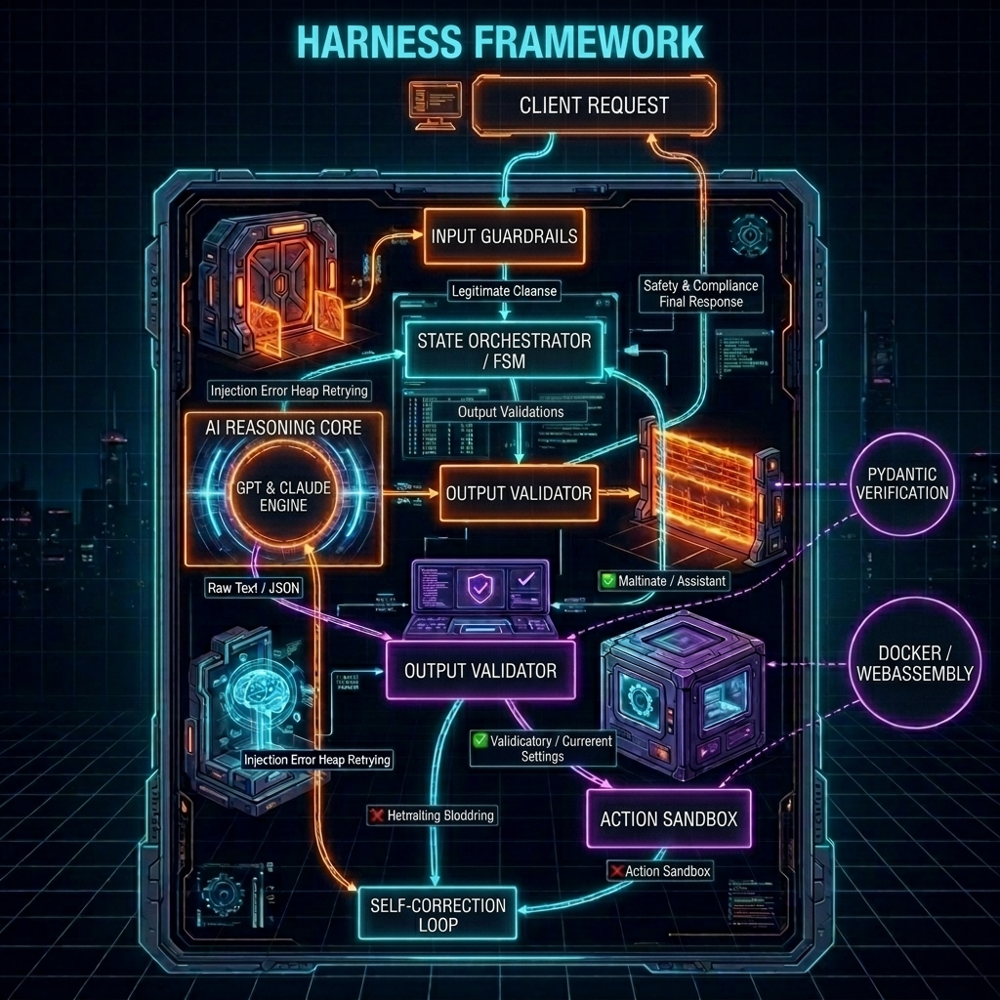
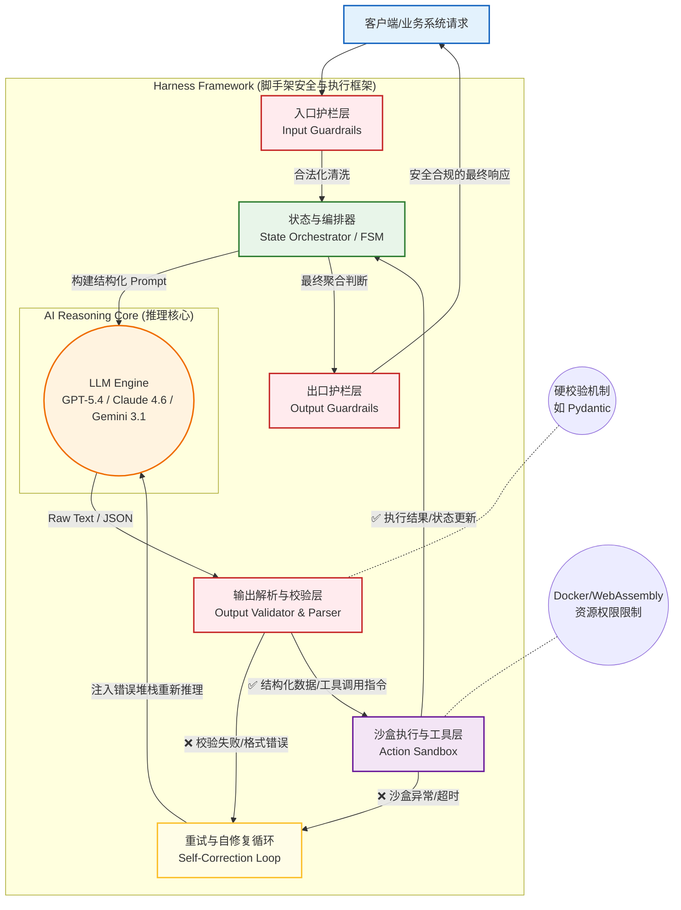

# 写提示词已经不够用了！深度拆解 AI 下半场的底层密码：Harness 脚手架工程

> 导语：在开发 AI Agent 项目时，你是否遇到过这样的绝望时刻——写了上千字的提示词，AI 还是会莫名其妙地偏离主题？处理长任务时，AI 经常“嘴上说做完了，实际一行代码没写”？ 
>
> 告别“玩具时代”，在构建商业级 AI 应用时，我们必须认清一个残酷的事实：系统的高可靠性，永远不能建立在大模型的概率黑盒之上。

在大型语言模型（LLM）的落地实践中，行业逐渐沉淀出了四个不同层级的工程化方向：**Prompt Engineering**（提示工程）、**Context Engineering**（上下文工程）、**Agent Engineering**（智能体工程），以及近期愈发受到大厂重视的终极底座——**Harness Engineering**（脚手架/线束工程）。

如果把构建 AI 应用比作制造一辆现代汽车，我们可以这样理解这四者的定位：

*   【Prompt 提示层】：你是驾驶员踩下油门的方式，告诉引擎你需要去哪里。
*   【Context 上下文层】：你是车载导航和雷达系统，时刻为引擎提供路况和地图。
*   【Agent 智能体层】：你是自动驾驶算法，负责规划路线、调用外部工具。
*   【Harness 脚手架层】：你是最底层的**物理底盘、制动系统及保险丝**。它确保无论自动驾驶算法下达了多么离谱的指令，车子都不会在高速公路上倒车！

---

### 一、 一个最贴切的隐喻：给“烈马”套上缰绳

对于 Harness Engineering，业界有一个极具画面感的隐喻：**驾驭烈马**。

千万不要把大模型当成绝对理性的流水线工。大模型（LLM）更像是一匹力量不可思议、速度极快，但“方向感极其不稳定”的烈马。
它不天然遵守你的代码规范，不天然知道怎么连数据库，更不会在犯错时主动停下求助。

**Harness Engineering 的本质，就是给这匹烈马配上「缰绳 + 马鞍 + 跑道护栏 + 反馈镜子」。**

Harness 不是用来优化模型本身，让它变得更“聪明”的；而是构建一整套运行控制系统，让它在复杂的真实业务中：**跑得稳、跑得久、绝对不跑偏。**

---

### 二、 核心哲学：用“确定性的代码”包裹“非确定性的 AI”

在早期的 AI 开发中，大家喜欢把要求一股脑全写进 System Prompt 里：“你必须输出合法 JSON”、“不要随意删除文件”。

但 Harness 的核心理念截然不同，它遵循三大极客哲学：

1.  **控制反转 (Inversion of Control)**
    不能让大模型主导整个工作流。在 Harness 架构中，外围的传统代码（编排器状态机）才是主体，大模型只被当作纯粹的“逻辑推理函数”来调用。
2.  **深度防御编程 (Deep Defensive Programming)**
    永远假设大模型的输出是不可靠、有瑕疵甚至危险的。数据到达真实业务或数据库之前，必须经过强类型的反序列化（如 Pydantic）拦截。
3.  **确定性的物理隔离 (Deterministic Isolation)**
    绝不让 AI 在主系统裸奔。给它动态分配微型沙盒（Sandbox）去跑代码、给接口设定极短的超时时间，防止单点失控引发全局崩溃。

---

### 三、 架构透视：Harness 是如何工作的？
#### 架构原理图

一个企业级的 Harness 开发框架在架构上往往像一个**多层精密过滤的压舱净水系统**。正如全新架构图所示，当一条不可预知的自然语言流注入业务系统时，它绝不会直接越级投递给大模型，而是至少经历这五大极客级的物理拦截防线：

**1. Input Guardrails（入口防御护栏层）：零信任的准入拦截**
这是 Harness 的“前置雷达”。所有用户的非结构化请求（Client Request）在此被强制洗礼。若包含黑客的 Prompt 注入攻击（Injection）、越权刺探或触发安全合规，它会被直接中断。**脏数据还没见到大模型的面，就已经被物理防火墙剥离了。**

**2. State Orchestrator（状态机与全局编排器）：剥夺 AI 的主控制权**
在玩具 Agent 中，系统由 AI 自由发挥决定后续走向。但在 Harness 规范中，传统高可用并发系统里的 FSM（有限状态机）才是主驾驶。AI 被降维成了听话的“脑力算子”（AI Reasoning Core）。只有当主程序状态机推进到特定阶段，才会按需挂载并触发指定模型的推演，实现了防翻车核心定律：**控制反转**。

**3. Output Validator（强类型规则校验网）：封锁不可控的大赏模型幻象**
大模型总喜欢在结构化输出时自作多情地加一句“好的，我已经帮您分析完成了”。在 Harness 架构下，LLM 吐出的每比特数据都要被类似 Pydantic 或 Schema Parser 这种极权验证器死死卡住。只要缺少关键主键、Json 格式越界或者生成了莫须有的参数，在 **出口护栏（Output Guardrails）** 层面就会被无情驳回！

**4. Action Sandbox（沙盒物理隔离禁区）：动作降权执行层**
高并发、强执行力的顶级 Agent 必须拥有生成和运行外部工具（跑脚本、插库、请求外部接口）的代码执行流能力。Harness 绝对不信任大模型的即兴代码！所有的工具调用行动都会被丢进剥离宿主机网络和操作权限的一次性的 Docker 或 WebAssembly **重防备无菌室**。执行超时？直接连锅销毁！

**5. Self-Correction Loop（闭环隐蔽自修复回路）**
当沙盒爆出空指针，或者出口拦截器发现输出参数丢失时，Harness **不会向外部前端丢出一个血红的“系统报错框”**。在普通用户毫无察觉的暗网上，Harness 会将失败堆栈日志（Error Heap）悄悄打包，塞回给大模型大脑重试循环。强行勒令 AI 收紧逻辑链进行二次回演，直到得出符合验证标准的输出交还，系统才将其放行给业务端。

由此可见，正是这些用传统、稳健、死板的旧时代代码布下的天罗地网，**才彻底将“开盲盒式”的大语言模型调教为了能够支撑交易、风控乃至工业级严苛 SLA 承诺的【高确定性生产部件】**。

#### 架构设计
为了实现上述原理，一个标准的企业级 Harness（如 Anthropic 的生产级集成或类似的 Agent 脚手架引擎）通常具备如下多层剥离的架构设计：

---

### 四、 防翻车心得：五招落地的企业级最佳实践

当你要为自己的 Agent 打造一套 Harness 系统时，请抛弃“软约束”（只靠提示词），拥抱“硬约束”（靠代码强校验）。以下是五个能让稳定性瞬间暴涨的王炸思路：

#### 第一招：为机器定制项目说明书（AGENTS.md）
你的 AI 刚接入项目时是个“瞎子”。你需要准备一份专供模型阅读的 `AGENTS.md`。
里面不需要写太多废话，只保留【技术栈】、【关键开发命令】、【架构规则】。遵循**“渐进披露”**原则，不要一次把几万字文档丢给它，主说明书告诉它基础路线，详细文档让它按需调用工具读取。

#### 第二招：防“嘴上完成”的物理拦截器
这是 AI 开发最常见的天坑——模型自信地说：“任务已完成！”但由于幻觉其实什么都没动。
Harness 必须在状态转换时落下一把硬锁：**想要宣告成功？请出示你的工具调用日志！** 如果检测到声明完工但后台根本没有任何真实测试脚本运行的痕迹，拦截器直接打回，强迫模型老老实实跑验证。

#### 第三招：执行与裁判的分权制衡（Dual-Agent Review）
在长链路任务里，AI 往往会越跑越懒，极容易在后期“自行放水”。
不要用同一个会话即当运动员又当裁判！最稳妥的做法是：Agent A 负责输出代码，Harness 拿着产物起一个全薪的、不带有长上下文疲劳的 Agent B 进行冷酷的交叉 Review。

#### 第四招：死循环撞墙阻断器（Loop Detection）
模型经常会在一个编译错误上钻牛角尖，修改十次都是同一个错。这不仅烧干了 Token，还拖死了服务器。
**引入熔断器**：在后台监控相同 Action 和相同 Error 的双重哈希指纹，一旦发现它连续撞墙 3 次，立刻剥夺执行权。向模型抛出高级别干预指令强制换路，或者立即报警移交人类干预。

#### 第五招：让系统“吃一堑长一智”
不要停留在每次靠人工 Debug 后去改 Prompt 的低级阶段。
出现故障解决后，将这个“反例”抽象出来，写入 `.harness/lessons-learned.md`（系统教训备忘录）。系统在下次启动同类任务时，底层挂载这本备忘录。让 AI 用此前的失败喂养未来的上限。

---

### 结语

在当下的大模型浪潮中，我们不再需要盲目崇拜模型的体量。我们更需要正视 LLM 先天的脆弱状态。

**Prompt 提示词开发了 AI 聪明的大脑，而 Harness 脚手架工程则铸造了牵引大脑的钢铁缰绳。** 只有掌握这套工程心法，才能赋予 AI 在真实商业世界中稳定交付的资格。

> 你的 AI 团队还在为了“怎么写好提示词”焦头烂额吗？或许是时候给架构加上一层 Harness 了！欢迎在评论区分享你的 AI 落地血泪史。
